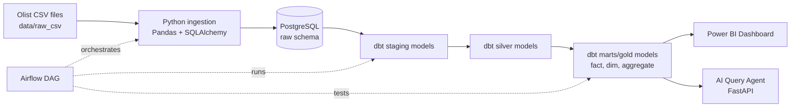
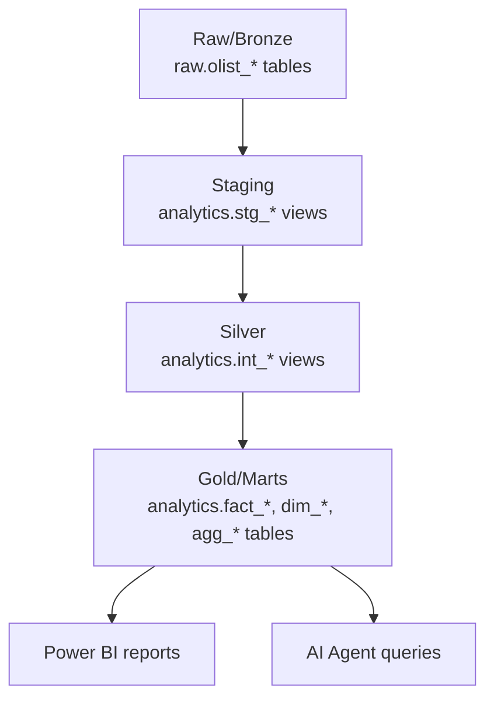
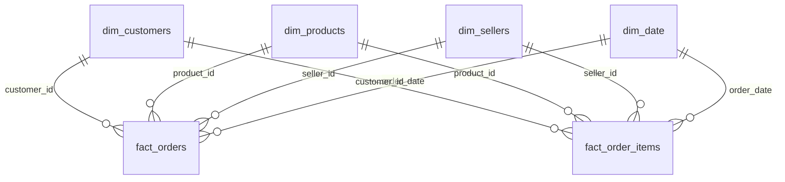
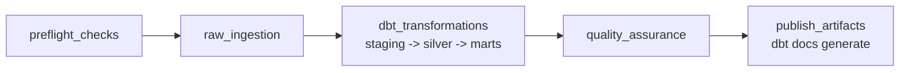

# Olist E-commerce Data Lakehouse, BI Dashboard and AI Query Agent

Đồ án này xây dựng một hệ thống phân tích dữ liệu thương mại điện tử dựa trên bộ dữ liệu Olist. Mục tiêu là mô phỏng một kiến trúc Data Lakehouse/Medallion ở mức dễ triển khai: dữ liệu thô được nạp vào PostgreSQL, được xử lý theo nhiều lớp bằng dbt, được điều phối bằng Airflow, sau đó dùng cho Power BI dashboard và AI Agent hỏi dữ liệu bằng ngôn ngữ tự nhiên.

Project được viết theo hướng thực hành cho đồ án tốt nghiệp: chạy được bằng Docker, có pipeline rõ ràng, có kiểm tra chất lượng dữ liệu, có mô hình dữ liệu phục vụ báo cáo, và có hướng dẫn Power BI để dựng dashboard tương tự mẫu.

## Nội Dung Chính

- Nạp dữ liệu Olist CSV vào PostgreSQL.
- Tổ chức dữ liệu theo kiến trúc Medallion: Raw/Bronze, Staging, Silver, Gold/Marts.
- Biến đổi dữ liệu bằng dbt thành star schema và các bảng tổng hợp.
- Điều phối pipeline bằng Airflow.
- Kiểm tra chất lượng dữ liệu bằng Python validation và dbt tests.
- Kết nối Power BI vào PostgreSQL để xây dashboard bán hàng, sản phẩm, khách hàng và người bán.
- Cung cấp AI Agent đơn giản để hỏi dữ liệu bằng câu hỏi tự nhiên.

## Tech Stack

| Thành phần | Công nghệ | Vai trò |
| --- | --- | --- |
| Source data | Olist CSV | Dữ liệu thương mại điện tử đầu vào |
| Database/Warehouse | PostgreSQL | Lưu raw data và analytics marts |
| Ingestion | Python, Pandas, SQLAlchemy | Đọc CSV, clean nhẹ, load vào schema `raw` |
| Transformation | dbt | Chuẩn hóa, join, tạo fact/dim/aggregate tables |
| Orchestration | Apache Airflow, Astronomer Cosmos | Chạy pipeline theo thứ tự và hiển thị lineage model-level |
| BI | Power BI Desktop | Dashboard phân tích |
| AI Agent | FastAPI, OpenAI optional | Chatbot hỏi dữ liệu bằng ngôn ngữ tự nhiên |
| Deployment | Docker Compose | Chạy toàn bộ dịch vụ local |

## System Architecture



Trong repo mẫu bạn gửi, hệ thống dùng MinIO, Delta Lake, Spark, Presto và Hive Metastore. Project này đi theo ý tưởng tương tự nhưng dùng stack gọn hơn để dễ chạy đồ án:

- MinIO/Data Lake được thay bằng PostgreSQL schema `raw`.
- Bronze/Silver/Gold được thể hiện bằng raw schema và dbt model layers.
- Dagster trong repo mẫu được thay bằng Airflow.
- Metabase trong repo mẫu được thay bằng Power BI.
- Dữ liệu vẫn đi theo tư duy lakehouse: lưu raw, chuẩn hóa, làm sạch, tổng hợp, rồi phục vụ phân tích.

## Medallion Data Layers



### Raw/Bronze Layer

Đây là lớp đầu tiên tiếp nhận dữ liệu. CSV từ `data/raw_csv/` được load vào PostgreSQL schema `raw`.

Ví dụ bảng:

- `raw.olist_orders_dataset`
- `raw.olist_order_items_dataset`
- `raw.olist_order_payments_dataset`
- `raw.olist_order_reviews_dataset`
- `raw.olist_customers_dataset`
- `raw.olist_products_dataset`
- `raw.olist_sellers_dataset`
- `raw.product_category_name_translation`

Vai trò:

- Giữ dữ liệu gần với source ban đầu.
- Là nơi kiểm tra số dòng, khóa chính, giá trị null quan trọng.
- Là đầu vào cho dbt.

### Staging Layer

Các model trong `dbt_project/models/staging/` chuẩn hóa tên cột, kiểu dữ liệu và format.

Ví dụ:

- `analytics.stg_orders`
- `analytics.stg_order_items`
- `analytics.stg_order_payments`
- `analytics.stg_order_reviews`
- `analytics.stg_customers`
- `analytics.stg_products`
- `analytics.stg_sellers`

Vai trò:

- Chuẩn hóa timestamp/date.
- Chuẩn hóa tên field.
- Áp dụng dbt tests cơ bản như `unique`, `not_null`, `relationships`, `accepted_values`.

### Silver Layer

Các model trong `dbt_project/models/silver/` kết hợp dữ liệu đã chuẩn hóa để tạo bảng trung gian có ý nghĩa nghiệp vụ.

Ví dụ:

- `analytics.int_order_payments_summary`
- `analytics.int_dominant_payment_type`
- `analytics.int_order_reviews_summary`
- `analytics.int_latest_order_review`
- `analytics.int_order_item_metrics`
- `analytics.int_order_totals`
- `analytics.int_order_items_enriched`
- `analytics.int_orders_enriched`

Vai trò:

- Tổng hợp payment theo đơn hàng.
- Tính doanh thu, phí vận chuyển, số item.
- Gắn review score mới nhất.
- Tính thời gian duyệt đơn, thời gian giao hàng, đơn giao đúng hạn.

### Gold/Marts Layer

Các model trong `dbt_project/models/marts/` là lớp cuối cùng dùng trực tiếp cho Power BI và AI Agent.

Fact tables:

- `analytics.fact_orders`: một dòng cho một đơn hàng.
- `analytics.fact_order_items`: một dòng cho một sản phẩm trong đơn hàng.

Dimension tables:

- `analytics.dim_customers`
- `analytics.dim_products`
- `analytics.dim_sellers`
- `analytics.dim_date`

Aggregate tables:

- `analytics.agg_sales_monthly`
- `analytics.agg_seller_performance`
- `analytics.agg_category_performance`

## Data Model Cho BI



Khuyến nghị khi làm Power BI:

- Dùng `fact_orders` cho KPI tổng quan theo đơn hàng.
- Dùng `fact_order_items` khi phân tích sản phẩm/category/seller chi tiết.
- Dùng `agg_sales_monthly`, `agg_category_performance`, `agg_seller_performance` nếu muốn kéo dashboard nhanh và đơn giản.

## Workflow Trong Airflow

DAG chính: `olist_etl_pipeline`



Các nhóm task:

- `preflight_checks`: kiểm tra file CSV và kết nối PostgreSQL.
- `raw_ingestion`: load raw data và validate raw layer.
- `dbt_transformations`: chạy dbt theo từng lớp bằng Astronomer Cosmos.
- `quality_assurance`: kiểm tra output analytics.
- `publish_artifacts`: tạo dbt docs.

## Project Structure

```text
.
├── airflow/
│   └── dags/
│       ├── etl_pipeline.py
│       └── olist_pipeline/
├── ai_agent/
│   ├── app.py
│   ├── config.py
│   ├── llm_interface.py
│   ├── mcp_server.py
│   └── sql_executor.py
├── data/
│   └── raw_csv/
├── dbt_project/
│   ├── dbt_project.yml
│   ├── profiles.yml
│   ├── models/
│   │   ├── staging/
│   │   ├── silver/
│   │   └── marts/
│   └── tests/
├── docker/
├── docs/
│   └── POWER_BI_GUIDE.md
├── ingestion/
│   ├── db_connection.py
│   └── load_data.py
├── requirements/
├── docker-compose.yml
└── README.md
```

## Cách Chạy Project

### 1. Chuẩn bị file môi trường

```bash
cp .env.example .env
```

Nếu chỉ chạy pipeline và Power BI thì không cần OpenAI key. Nếu muốn dùng AI Agent với OpenAI, cập nhật:

```env
OPENAI_API_KEY=your_key_here
OPENAI_MODEL=gpt-4o-mini
```

### 2. Start toàn bộ service

```bash
docker compose up --build
```

Các service chính:

- PostgreSQL: `localhost:5432`
- Airflow: `http://localhost:8080`
- AI Agent: `http://localhost:8000`

### 3. Chạy pipeline trong Airflow

Mở:

```text
http://localhost:8080
```

Trigger DAG:

```text
olist_etl_pipeline
```

Chờ các group task chạy xong theo thứ tự:

```text
preflight_checks -> raw_ingestion -> dbt_transformations -> quality_assurance -> publish_artifacts
```

### 4. Kiểm tra dữ liệu trong PostgreSQL

```bash
docker compose exec postgres psql -U olist -d olist_dw
```

Một số câu SQL kiểm tra:

```sql
select count(*) from raw.olist_orders_dataset;
select count(*) from analytics.fact_orders;
select count(*) from analytics.fact_order_items;
select * from analytics.agg_sales_monthly order by year_month limit 10;
```

Thoát PostgreSQL:

```sql
\q
```

### 5. Chạy dbt thủ công nếu cần

```bash
docker compose exec dbt bash -lc "cd /opt/project/dbt_project && dbt run --profiles-dir ."
docker compose exec dbt bash -lc "cd /opt/project/dbt_project && dbt test --profiles-dir ."
docker compose exec dbt bash -lc "cd /opt/project/dbt_project && dbt docs generate --profiles-dir ."
```

## Power BI Dashboard

Dashboard nên chia thành 3 trang giống mẫu:

1. Order Management
2. Product Analysis
3. Sales and Customer Management

File hướng dẫn chi tiết nằm ở:

- [docs/POWER_BI_GUIDE.md](docs/POWER_BI_GUIDE.md)

Tóm tắt các bước:

1. Mở Power BI Desktop.
2. Chọn `Get Data` -> `PostgreSQL database`.
3. Kết nối:
   - Server: `localhost`
   - Database: `olist_dw`
   - User: `olist`
   - Password: `olist`
4. Chọn các bảng trong schema `analytics`.
5. Tạo relationship giữa fact và dimension.
6. Tạo DAX measures.
7. Dựng dashboard theo 3 trang.

Các bảng nên import:

- `analytics.fact_orders`
- `analytics.fact_order_items`
- `analytics.dim_customers`
- `analytics.dim_products`
- `analytics.dim_sellers`
- `analytics.dim_date`
- `analytics.agg_sales_monthly`
- `analytics.agg_category_performance`
- `analytics.agg_seller_performance`

Một số measure cơ bản:

```DAX
Total Revenue = SUM(fact_orders[total_amount])

Total Orders = DISTINCTCOUNT(fact_orders[order_id])

Total Quantity = SUM(fact_orders[item_count])

Unique Customers = DISTINCTCOUNT(fact_orders[customer_id])

Active Sellers = DISTINCTCOUNT(fact_orders[seller_id])

Average Order Value = DIVIDE([Total Revenue], [Total Orders])

On Time Delivery Rate =
AVERAGEX(
    fact_orders,
    IF(fact_orders[is_delivered_on_time] = TRUE(), 1, 0)
)
```

## AI Agent

Mở chatbot:

```text
http://localhost:8000
```

Ví dụ gọi API:

```bash
curl -X POST http://localhost:8000/query \
  -H "Content-Type: application/json" \
  -d '{"question":"Total revenue by month"}'
```

Các câu hỏi mẫu:

- `Total revenue by month`
- `Total orders by state`
- `Top sellers by revenue`

AI Agent chỉ cho phép chạy câu lệnh `SELECT` để giảm rủi ro khi demo.

## Data Quality

Project có hai lớp kiểm tra chính:

- Python validation trong ingestion:
  - Kiểm tra file CSV có tồn tại.
  - Kiểm tra bảng rỗng.
  - Kiểm tra duplicate primary key ở các bảng chính.
  - Kiểm tra null ở cột quan trọng như `order_id`, `customer_id`, `product_id`, `seller_id`.

- dbt tests:
  - `unique`
  - `not_null`
  - `relationships`
  - `accepted_values`
  - custom SQL tests trong `dbt_project/tests/`

Chạy test:

```bash
docker compose exec dbt bash -lc "cd /opt/project/dbt_project && dbt test --profiles-dir ."
```

## Data Lineage

Lineage tổng quan:

```text
CSV files
  -> raw schema
  -> staging models
  -> silver intermediate models
  -> marts/gold models
  -> Power BI / AI Agent
```

Lineage dbt chi tiết có thể xem qua Airflow UI vì DAG dùng Astronomer Cosmos để render từng dbt model thành task riêng.

## Demo Flow Gợi Ý

1. Giới thiệu dataset Olist trong `data/raw_csv/`.
2. Trình bày kiến trúc Medallion: Raw/Bronze -> Staging -> Silver -> Gold.
3. Mở Airflow, trigger DAG `olist_etl_pipeline`.
4. Mở PostgreSQL kiểm tra bảng raw và analytics.
5. Mở Power BI dashboard:
   - KPI tổng doanh thu, tổng đơn, tổng khách hàng, active seller.
   - Doanh thu theo thời gian.
   - Phân tích payment type.
   - Top category theo doanh thu/số lượng.
   - Doanh thu theo state.
6. Mở AI Agent và hỏi `Total revenue by month`.

## Go-live Local Runbook

Chạy lần 1 theo đúng thứ tự này để dễ bắt lỗi:

```bash
cp .env.example .env
docker compose up --build
```

Mở Airflow:

```text
http://localhost:8080
```

Trigger DAG:

```text
olist_etl_pipeline
```

Sau khi DAG xanh, kiểm tra warehouse:

```bash
docker compose exec postgres psql -U olist -d olist_dw
```

```sql
select count(*) from raw.olist_orders_dataset;
select count(*) from analytics.fact_orders;
select count(*) from analytics.fact_order_items;
select * from analytics.agg_sales_monthly order by year_month limit 5;
\q
```

Chạy dbt test lại nếu cần xác nhận riêng:

```bash
docker compose exec dbt bash -lc "cd /opt/project/dbt_project && dbt test --profiles-dir ."
```

Kiểm tra AI Agent:

```bash
curl http://localhost:8000/health
curl -X POST http://localhost:8000/query \
  -H "Content-Type: application/json" \
  -d '{"question":"Total revenue by month","limit":10}'
```

Mở chatbot:

```text
http://localhost:8000
```

Nếu gặp lỗi thường gặp:

- `docker: command not found`: bật Docker Desktop -> Settings -> Resources -> WSL Integration -> enable distro đang dùng.
- Airflow preflight fail kết nối PostgreSQL: kiểm tra `.env` đang dùng `POSTGRES_USER=olist` và `POSTGRES_PASSWORD=olist`.
- dbt relation missing: trigger lại DAG từ đầu hoặc chạy `docker compose down -v` rồi `docker compose up --build` để reset database local.
- AI Agent báo thiếu OpenAI key: các câu hỏi mẫu vẫn chạy bằng rule-based; muốn hỏi tự do thì điền `OPENAI_API_KEY` trong `.env`.

## Ghi Chú

- Dataset trong repo có thể là bản rút gọn để chạy nhanh. Khi nộp đồ án có thể thay bằng full Olist dataset.
- Nếu đổi dữ liệu CSV, chạy lại Airflow DAG để cập nhật toàn bộ raw, silver và marts.
- Nếu Power BI không kết nối được PostgreSQL, kiểm tra container `olist_postgres` đã healthy và port `5432` chưa bị service khác chiếm.
